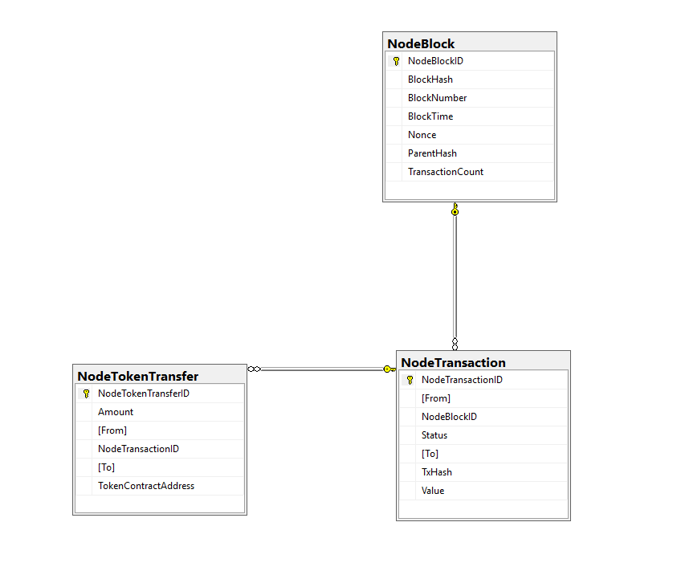

# Nethereum Blockchain Store SQL

The Nethereum blockhain store is a library that allows the retrieving and storage of the Ethereum Blockchain by connecting a Node using RPC and Nethereum.

The current implementation processes and stores Blocks, Transactions and Token Transfers.

All data will be written to SQL tables. If you want to personalize data or to know how to decode token transfer events you can use this library.

## Entities


## Core Library

It uses code-first technique to create entities and SQL tables. There are three tables for data; 
NodeBlock for ethereum block data
NodeTransactions for ethereum transactions
NodeTokenTransfer for token transfers 

## Console processor

The console processor sample demonstrates how to process a range of blocks.

### Initialisation of the components

#### DBContext Setup 

```csharp
private static void ConfigureServices(IServiceCollection services)
{
    var optionsBuilder = new DbContextOptionsBuilder<ApplicationDbContext>();
    optionsBuilder.UseSqlServer(@"Server=localhost; Database=BlockchainStore;Integrated Security=True;");
    ApplicationDbContext con = new ApplicationDbContext(optionsBuilder.Options);
    unitOfWork = new UnitOfWork(con);
}
```

### Block Processing
When console app starts, it finds the latest blocknumber in DB and latestblocknumber in network using web3. If there is no block data, it starts from block number which you can specify. 

```csharp
 var blocks = repositoryBase.GetRepository<NodeBlock>().GetAll();
 int startBlock = 5623328;
 if (blocks.Count() > 0)
   startBlock = blocks.Max(x => x.BlockNumber);
 var latestblock = await web3.Eth.Blocks.GetBlockNumber.SendRequestAsync();
 new Helpers().AddLog(LogType.Info, $"Last Block in DB : {startBlock} , Last Block in Network : {latestblock.Value}");
 var endBlock = (int)latestblock.Value;

 while (startBlock <= endBlock)
 {
   try
   {
     new Helpers().AddLog(LogType.Process, $"Block-{startBlock} Processing");
     var block = await blockProcessor.ProcessBlockAsync(startBlock);
     new Helpers().AddLog(LogType.Success, $"Block-{startBlock} Processed");

     new Helpers().AddLog(LogType.Info, $"Block-{startBlock} Transactions Processing, Tx Count : {block.TransactionHashes.Length} ..");
     await transactionsProcessor.ProcessTransactionAsync(block);
     new Helpers().AddLog(LogType.Success, $"Block-{startBlock} Transactions Processed");
   }
   catch (Exception e)
   {
	 }
   startBlock++;
 }
```

### Transaction Processing
After block processing,it uses this block for getting transaction hashes, and for every hash in this block, it gets transaction details from network using Nethereum.

```csharp
nodeBlock.NodeTransactions = new List<NodeTransaction>();

foreach (var _hash in block.TransactionHashes)
{
  await CheckandFillTransactionAsync(_hash, block.Timestamp.Value);
}
try
{
  repositoryBase.Commit();
}
```

### Token Transfer Processing
After every transaction process, it gets transcation logs from network. If log is a token transfer type log, it decodes this data using Nethereum and saves to DB.


```csharp
var _txlogs = transactionReceipt.Logs.ToObject<List<TransactionLog>>();
foreach (var _log in _txlogs)
{
  try
  {
    if (_log.topics.First() != TransferEventKeccak)
      continue;
    if (_log.topics.Length < 3)
      continue;

    transaction.NodeTokenTransfers.Add(new NodeTokenTransfer()
    {
      Amount = new Helpers().HextoString(_log.data), 
      From = new AddressType().Decode<string>(_log.topics[1]),
      To = new AddressType().Decode<string>(_log.topics[2]),
      TokenContractAddress = transactionSource.To
    });
    _order++;
  }
}
```